# Travelog

# 여행 공유 커뮤니티 'Travelog'
## 1. 개요와 기능

### 1.1 개요
'Travelog'는 여행 경험을 공유하고, 탐색하며, 다른 사용자와 소통할 수 있는 온라인 커뮤니티입니다. 사용자는 자신의 여행 경험을 게시글로 작성하고, 태그를 붙여 다른 사용자가 쉽게 찾을 수 있게 할 수 있습니다. 또한, 다른 사용자의 게시글을 좋아요하거나 댓글을 남겨 소통할 수 있습니다.

### 1.2 기능

**추천 여행 일정 수립 기능**:
*  게시글 작성: 사용자는 여행 경험을 게시글로 작성할 수 있습니다. 게시글에는 제목, 내용, 여행 시작일 및 종료일, 위치 정보(위도, 경도) 등이 포함됩니다.
* 태그 기능: 사용자는 작성한 게시글에 태그를 붙일 수 있습니다. 태그는 여행 장소, 테마 등으로 분류할 수 있습니다.
* 좋아요 기능: 사용자는 자신이 좋아하는 게시글에 좋아요를 누를 수 있습니다. 좋아요 수는 게시글의 인기도를 나타내는 지표로 사용됩니다.
* 댓글 기능: 사용자는 게시글에 댓글을 남길 수 있습니다. 댓글은 다른 사용자와의 소통을 돕고, 게시글에 대한 피드백을 제공하는 방법입니다.

## 2. 개발 환경 및 배포 URL

### 2.1 개발 환경
- BE: Django 
- FE: bootstrap Framework, css

- 서비스 배포 환경
  - Github Pages

### 2.2 배포 URL/
# travelog  

# SUPERUSER
travelog
travelog@gmail.com
트래블로그123!


### 2.3 URL 구조(모놀리식)
| App | URL | Views Function | HTML File Name | Note |
| ---- | ---- | ---- | ---- | ---- |
| TravelMate | `/` | `home_view` | `index.html` | 홈페이지 |
| Accounts | `/login` | `login_view` | `login.html` | 사용자 로그인 페이지 |
| Accounts | `/users/register` | `register_view` | `register.html` | 사용자 등록 페이지 |
| Accounts | `/users/{userId}` | `user_detail_view` | `user_detail.html` | 사용자 정보 조회 페이지 |
| Blog | `/blog_list` | `post_list_view` | `post_list.html` | 게시글 목록 페이지 |
| Blog | `/blog_details` | `post_detail_view` | `post_detail.html` | 게시글 상세 페이지 |
| Blog | `/blog_create` | `post_create_view` | `post_form.html` | 게시글 작성 페이지 |
| Blog | `/blog_update` | `post_update_view` | `post_form.html` | 게시글 수정 페이지 |
| Blog | `/blog_delete` | `post_delete_view` | `post_confirm_delete.html` | 게시글 삭제 확인 페이지 |
| Blog | `/tags` | `tag_list_view` | `tag_list.html` | 태그 목록 조회 페이지 |
| Comment | `/posts/{postId}/comments/new` | `comment_create_view` | `comment_form.html` | 댓글 작성 페이지 |
| Comment | `/comments/{commentId}/edit` | `comment_update_view` | `comment_form.html` | 댓글 수정 페이지 |
| Comment | `/comments/{commentId}/delete` | `comment_delete_view` | `comment_confirm_delete.html` | 댓글 삭제 확인 페이지 |
| Like | `/posts/{postId}/likes` | `like_create_view` | - | 게시글 좋아요 기능 (동기) |

## 3. 요구사항 명세와 기능 명세


폴더 트리## 4. 프로젝트 구조와 개발 일정
### 4.1 프로젝트 구조
- 프로젝트구조
  
📦Travelog
┣ 📂main
┃ ┣ 📂static
┃ ┃ ┣ 📂img
┃ ┃ ┗ 📂css
┃ ┗ 📂media
┣ 📂templates
┃ ┣ 📂accounts
┃ ┣ 📂blog
┃ ┣ 📜base.html
┃ ┗ 📜base_login.html
┣ 📂Accounts
┣ 📂Blog
┃ 📜WBS_dooji.xlsx
┗ 📜README.md

### 4.2 개발 일정(WBS)

```mermaid
gantt
1(1. 프로젝트 계획 및 준비) --> 1.1(1.1 프로젝트 목표 및 범위 설정)
1 --> 1.2(1.2 필요 기술 및 도구 조사)
1 --> 1.3(1.3 개발 환경설정)
1 --> 1.4(1.4 GitHub 레포지토리 설정)
1 --> 1.5(1.5 프로젝트명 상표 확인(KIPRIS))

2(2. weniv, naver api 사용) --> 2.1(2.1 weniv api 복사 및 사용)

3(3. 디자인 및 사용자 인터페이스 구현) --> 3.1(3.1 사용자 인터페이스 디자인 (kakao oven))
3 --> 3.2(3.2 HTML과 CSS를 이용한 웹 페이지 구현)

4(4. 블로그 기능구현) --> 4.1(4.1 Django Admin을 이용한 게시글 읽기 및 메인페이지 구현)
4 --> 4.2(4.2 블로그 CRUD 기능 구현)
4 --> 4.3(4.3 로그인/회원가입 기능을 이용 블로그 구현)
4 --> 4.4(4.4 블로그 기능 외 추가 기능 작성 및 배포)

5(5. 테스트 및 디버깅) --> 5.1(5.1 각 기능별 테스트 진행)
5 --> 5.2(5.2 버그 및 이슈 해결)

6(6. 코드 리뷰 및 개선) --> 6.1(6.1 코드 리뷰 진행)
6 --> 6.2(6.2 리뷰를 통한 코드 개선)

7(7. 프로젝트 제출) --> 7.1(7.1 GitHub에 최종 코드 업데이트)

```

### 6.21 화면 설계
 
<table>
    <tbody>
        <tr>
            <td>로그인</td>
            <td>회원가입</td>
        </tr>
        <tr>
            <td></td>
            <td></td>
        </tr>
        <tr>
            <td>프로필</td>
            <td>여행로그목록</td>
        </tr>
        <tr>
            <td></td>
            <td></td>
        </tr>
        <tr>
            <td>여행로그상세페이지</td>
            <td>페이지없음</td>
        </tr>
        <tr>
            <td></td>
            <td></td>
        </tr>
    </tbody>
</table>

과업
## 9. 메인 기능

```mermaid
graph TD
    A("/ (홈페이지)") --> B("home_view")
    B --> C("index.html")

    D("/login (로그인 페이지)") --> E("login_view")
    E --> F("login.html")

    G("/users/register (사용자 등록 페이지)") --> H("register_view")
    H --> I("register.html")

    J("/users/{userId} (사용자 정보 조회 페이지)") --> K("user_detail_view")
    K --> L("user_detail.html")

    M("/blog_list (게시글 목록 페이지)") --> N("post_list_view")
    N --> O("post_list.html")

    P("/blog_details (게시글 상세 페이지)") --> Q("post_detail_view")
    Q --> R("post_detail.html")

    S("/blog_create (게시글 작성 페이지)") --> T("post_create_view")
    T --> U("post_form.html")

    V("/blog_update (게시글 수정 페이지)") --> W("post_update_view")
    W --> X("post_form.html")

    Y("/blog_delete (게시글 삭제 확인 페이지)") --> Z("post_delete_view")
    Z --> AA("post_confirm_delete.html")

    AB("/tags (태그 목록 조회 페이지)") --> AC("tag_list_view")
    AC --> AD("tag_list.html")

    AE("/posts/{postId}/comments/new (댓글 작성 페이지)") --> AF("comment_create_view")
    AF --> AG("comment_form.html")

    AH("/comments/{commentId}/edit (댓글 수정 페이지)") --> AI("comment_update_view")
    AI --> AJ("comment_form.html")

    AK("/comments/{commentId}/delete (댓글 삭제 확인 페이지)") --> AL("comment_delete_view")
    AL --> AM("comment_confirm_delete.html")

    AN("/posts/{postId}/likes (게시글 좋아요 기능)") --> AO("like_create_view")
```



## 10. 개발하며 느낀점

1. **변경 코드 추적하기와 필요성:** 코드 변경사항을 효율적으로 관리하고 추적하기 위해 로컬 커밋 활용, 브랜치 전략 채택, .gitignore 파일 사용, 작업 단위로의 커밋, 그리고 정기적인 코드 리뷰의 중요성을 깨달았습니다. 이러한 방법들은 개발 과정에서의 실수를 줄이고, 코드의 품질을 향상시키며, 협업과 코드 관리를 원활하게 만들어줍니다.

2. 에러와 에러 해결
 **에러:
